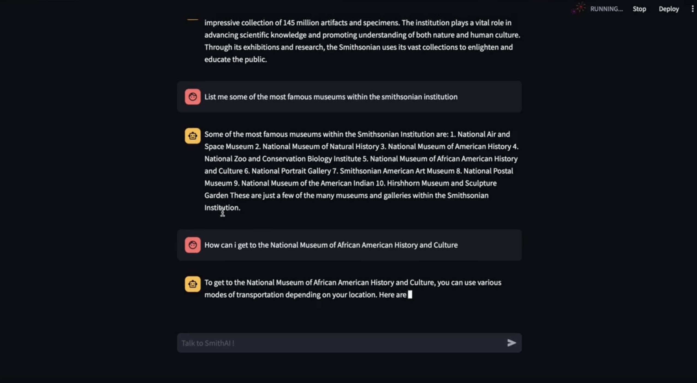

# 🏛️ Museums Web Scraper & Langchain QA Interface

- This project combines two components:

1. **`web_scrap.py`** – A Python script that scrapes data from the Smithsonian museums website and generates structured PDFs.
2. **`langchainll.py` / `langchain.ipynb`** – A Langchain-powered interface for answering questions based on the scraped data (via a web interface with Streamlit).

---


---

## 📚 Libraries & Tools Used


```yaml
libraries:
  scraping:
    - requests       # For HTTP requests
    - beautifulsoup4 # For parsing HTML content
  pdf_generation:
    - pdfdocument    # For structured PDF creation
  llm_interface:
    - langchain      # For language model orchestration
    - openai         # For querying OpenAI LLMs
    - pinecone-client # For vector database retrieval (semantic memory)
    - tiktoken       # For tokenization with OpenAI models
  web_interface:
    - streamlit      # For launching interactive web apps
  utilities:
    - python-dotenv  # For loading environment variables from .env
```

---


## 📁 Project Configuration - Smithsonian Museum AI

#### This project includes a web scraper for museum data and a Langchain-powered question-answering
#### interface using Streamlit. The scraper generates structured PDFs of museum content, and the Streamlit app allows
#### single-question input with future chatbot support.

---

## Project Structure:


```yaml
  root:
    - data/                    # Folder where PDFs will be saved after running web_scrap.py
    - web_scrap.py             # Scraper script to extract and save data into PDFs
    - langchain.ipynb          # Jupyter Notebook with Langchain logic (includes chatbot version)
    - langchainll.py           # Streamlit app for answering a single question
    - requirements.txt         # Python dependency list
    - README.md                # Project instructions
```

- Setup:

  
```yaml
  virtual_environment:
    tool: virtualenv
```

- Terminal Commands :
  
```bash
python3 -m venv venv
source venv/bin/activate  # On Windows: venv\Scripts\activate
```

```python
dependencies:
  install_command: pip install -r requirements.txt
```


- After Installing all dependencies, run those commands on terminal to Launch the App :
```yaml
  scrape_command: python web_scrap.py
  app_launch_command: streamlit run langchainll.py
```

---





---

- Notes:


  - PDFs will be generated in the `data/` folder after running the scraper.
  - The current app supports single-question input.
  - To enable chatbot functionality, use the function already defined in `langchain.ipynb`.


---


## 📬 Contact :

- Youssef Benaouda, Freelancer in AI
- Mail : benaoudayoussef123@gmail.com
- Active on LinkedIn

